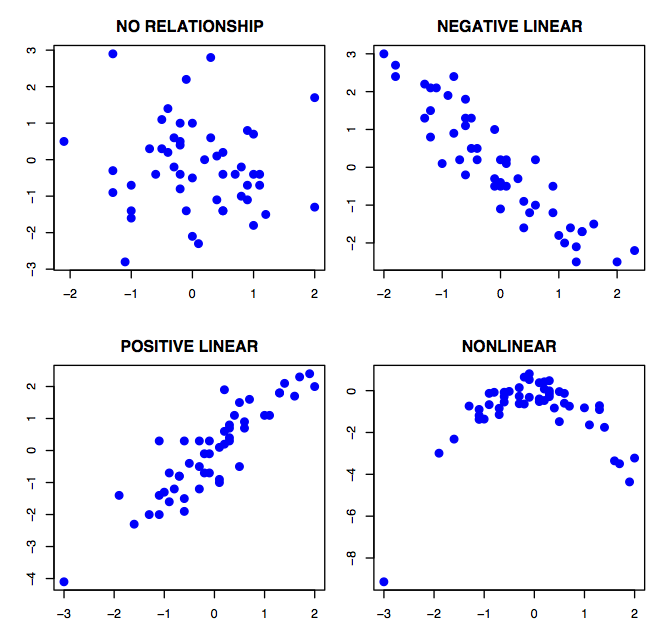
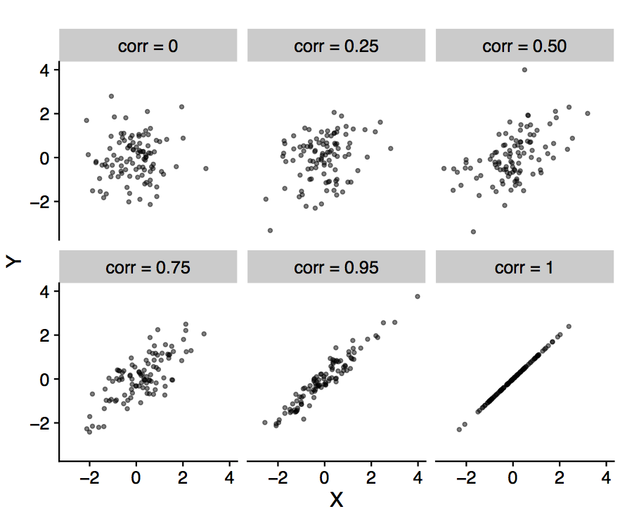

```{r setup, include=FALSE}
knitr::opts_chunk$set(echo = FALSE, warning=FALSE, message=FALSE, comment = "", collapse=TRUE)
options(width=60)
```

```{r}
library(magrittr)
library(tidyverse)
library(cowplot)
```


## Joint frequency distributions

In last lecture we defined the  *frequency distribution* of a variable as the number of times each value of that variable occurs in a sample.

\bigskip

We can extend this idea to consider two variables together, and define the *joint frequency distribution*  of two variables as the number of times each combination of values of those variables occurs in a sample.

\bigskip

Similarly the *joint relative frequency distribution* describes the fraction of occurences of each combination of values of two variables

## Contingency tables represent joint frequency distributions for categorical variables

- A *contingency table* represents all the possible combinations of two categorical variables
- Each cell represents the joint frequency for a particular combination of values.

\bigskip

### Example: Sex and survival on the Titanic

|        | Died                | Lived        |         
|--------|---------------------|--------------|
| Female | 127                 | 339          |
| Male   | 682                 | 161          |

## Creating a contingency table in R

The `table()` and `xtabs()` functions can be used to create contigency tables:

```{r}
titanic <- read_csv("https://tinyurl.com/titanic-bio304")
```

\medskip

### Using `table()`
```{r, echo=TRUE}
table(titanic$sex, titanic$survived)
```

\medskip

### Using `xtabs()`

```{r, echo=TRUE}
xtabs(~ sex + survived, data = titanic)
```

## `dplyr::count()` can also be used to calculate joint frequencies

Using dplyr count with multiple variables also computes the joint frequencies, but without the typical contingency table layout:

```{r, echo=TRUE}
titanic %>% count(sex, survived)
```


## Contingency table with marginal frequencies

It is often useful to also include the "marginal" frequncies in the contingency table. Marginal frequencies are the univariate frequencies.


\bigskip

### Example: Sex and survival on the Titanic

|        | Died    | Lived        | Total |        
|--------|---------|--------------|-------|
| Female | 127     | 339          | 466   |
| Male   | 682     | 161          | 843   |
| Total  | 809     | 500          | 1309  |


## Adding marginal frequencies to a contingency table in R

The function `addmargins()` can be used to add the marginal frequencies to a contingency table created by either `table()` or `xtabs()`

### Using `table()`
```{r, echo=TRUE}
addmargins(table(titanic$sex, titanic$survived))
```

\medskip

### Using `xtabs()`

```{r, echo=TRUE}
# For illustrative purposes I used piping 
# to avoid nested function calls
xtabs(~ sex + survived, data = titanic) %>% addmargins
```

## Independence / dependence of pairs of categorical variables

How do we decide if two categorical variables are somehow related or associated with  each other?


- We approach this by asking are the two variable *independent*.  If they are not independent, then we say they are *dependent* and hence associated.

- In a future lecture we will define *independence* formally in probabilistic terms, but for now let's say that two categorical variables are independent if specifying (conditioning) the state of one variable does not significantly change the relative frequencies of the states of the other variable. 

## In class example: Association between smoking and premature births in the NC Births dataset

Motivating question: Is there an association between mother's smoking status and premature births?

NC Births data set: https://tinyurl.com/ncbirths-bio304 (TSV formatted)

```{r, eval=TRUE, results="hide"}
births <- read_tsv("https://tinyurl.com/ncbirths-bio304")

births %>% count(premature)

births %>% count(premature) %>% mutate(rel.freq = n/sum(n))

births %>% count(premature, smoke)

births %>% 
  count(premature, smoke) %>% 
  filter(smoke == "nonsmoker") %>%
  mutate(rel.freq = n/sum(n))

births %>% 
  count(premature, smoke) %>% 
  filter(smoke == "smoker") %>%
  mutate(rel.freq = n/sum(n))
```

### To Do

1. Load the data set 
2. Compute the frequency distribution for the `premature` variable using `dplyr::count()`
3. Using the results of step 2, compute the relative frequency distribution for the `premature` variable. 
4. Compute the joint frequency distribution for the `premature` and `smoke` variables using `count()`
5. Using the results of step 4, compute the absolute and relative frequency distributions of the `premature` variable only for non-smoking mothers (HINT: `dplyr::filter()` is useful here)
6. Repeat step 5, but only for smoking mothers.
7. Compare the results of step 5 (frequency distribution of premature, conditioned on mother be non-smoker) and step 6 (frequency distribution of premature, conditioned on mother being smoker) to the results of step 3 (frequency distribution of premature, regardless of mother's smoking status)

## In class example: Association between sex and survival in the Titanic data set

Motivating question: Was there a relationship between passenger sex and survival on the Titanic?

\bigskip

Data set: https://tinyurl.com/titanic-bio304 (CSV fomatted)

\bigskip

### To Do:

Repeat steps 1 to 7 from the previous slide, but using the Titanic data set to explore the association between `sex` and `survived`.


## Testing for independence between categorical variables using the $\chi^2$-statistic

The concept that categorical variables are independent if specifying the state of one variable does not significantly change the relative frequencies of the states of the other variable, is the basis for a statistic called the $\chi^2$ (chi-squared).

The $\chi^2$ statistic is based on comparing the *observed counts* of the joint frequency distribution for two variables, to the *expected counts* you would get if the variables were independent.

The mathematical formula for the $\chi^2$ statistic is:

\begin{align*}
\chi^2 &= \frac{(O_{1,1} - E_{1,1})^2}{E_{1,1}} + \frac{(O_{1,2} - E_{1,2})^2}{E_{1,2}} + \cdots + \frac{(O_{m,n} - E_{m,n})^2}{E_{m,n}} \\
&= \sum_{i=1}^{m}\sum_{j=1}^{n} \frac{(O_{ij} - E_{i,j})^2}{E_{i,j}}
\end{align*}

where $m$ and $n$ are the number of categories of the two variables under consideration.

- The larger the $\chi^2$-statistic the stronger the evidence that the categorical variables are *not independent* (i.e. dependent).  Exactly how large this value has to be for us to conclude that the values are dependent will be discussed when we get to hypothesis testing.

## $\chi^2$-statistic, cont.

### Observed counts

- The observed counts, $O_{i,j}$, are simply the cells of the contigency table.

\medskip

Here again is the contigency table (w/out the margins) for the `sex` and `survived` variables in the Titanic data set:

```{r, echo=TRUE}
sex.survived <- titanic %>% xtabs(~ sex + survived, data = .) 
sex.survived
```

## $\chi^2$-statistic, cont.

### Expected counts 

The expected count, assuming independence of variables, for the cell at position $i,j$ in the contingency table is given by:

\[
E_{i,j} = \frac{\text{sum of row}\ i \times \text{sum of column}\ j}{\text{grand sum of all cells}}
\]

\medskip

The expected count of females who died ($E_{1,1}$) is:

```{r, echo=TRUE}
E_11 = (sum(sex.survived[1,]) * sum(sex.survived[,1])) / 
        sum(sex.survived)
E_11
```

\medskip

Similarly the expected count of females who survived  ($E_{1,2}$):

```{r, echo=TRUE}
E_12 = (sum(sex.survived[1,]) * sum(sex.survived[,2])) / 
        sum(sex.survived)
E_12
```


## In class example: Titanic sex and survival

Following the examples in the previous slide:

- Calculate the expected count of males who died, if we assume `sex` and `survived` are independent

- Calculate the expected count of males who survived, if we assume `sex` and `survived` are independent


## The `chisq.test()` function in R

The `chisq.test()` function takes care of computing all the observed and expected counts, and the corresponding $\chi^2$-statistic for us.

\medskip

\footnotesize

```{r, echo=TRUE}
sex.survival.chisq <- chisq.test(titanic$sex, titanic$survived)
```

- Observed counts:
```{r, echo=TRUE}
sex.survival.chisq$observed
```

- Expected counts:
```{r, echo=TRUE}
sex.survival.chisq$expected
```

- $\chi^2$-statistic
```{r, echo=TRUE}
sex.survival.chisq$statistic
```

\normalsize


## In class example: $\chi^2$-test for the NC Births data

- Use `chisq.test()` to compute the quantities for the $\chi^2$-test of the independence of `premature` and `smoke`
- What are the observed counts?
- What are the expected counts?
- What is the $\chi^2$-statistic?


## Representations of joint frequency distributions for continuous variables

For continuous variables:

  - joint frequency distributions can be represented using 2D bin or hex plots

  - joint relative frequency distributions can be represented using 2D density plots
  

## Creating a 2D bin plot in R to represent joint frequency distributions

`dplyr::geom_bin2d()` creates a 2D bin plot. See lecture notes on ggplot2 for details.

\bigskip

```{r, echo=FALSE, fig.height=3, fig.width = 6.5, out.width = "80%", fig.cap="A) Scatter plot; and B) 2D bin plot representing the joint frequency distribution of weeks of mother's age and father's age from the NC Births data set"}

base <- ggplot(births, aes(mAge, fAge))
axis.labels <- labs(x = "Mother's age (years) ", y = "Father's age (years)") 
color.scale <- scale_fill_continuous(low="antiquewhite", high="red")

scatter.plot <- base + geom_jitter() + axis.labels
bin.plot <- base + geom_bin2d(bins=9) + color.scale + axis.labels

plot_grid(scatter.plot, bin.plot, labels = "AUTO", rel_widths = c(1,1.25))
```

## In class activity: scatter plot and 2d bin plot

Create a scatter plot and 2d bin illustrating the joint frequency distribution of weeks of gestation (`weeks`) and birth weight (`weight`) in the NC births data set.


## Creating a 2D density plot in R to representing joint relative frequency distributions

`dplyr::geom_density_2d()` and `dplyr::stat_density_2d()` create 2D density plots. See lecture notes on ggplot2 for details.

\medskip

```{r, echo=FALSE, fig.height=3, fig.width = 4, fig.cap="A bivariate density plot overlain by a scatter plot, representing the joint relative frequency distribution of mother's and father's age from the NC Births data set", out.width="50%"}

axis.labels <- labs(x = "Mother's age (years)", 
                    y = "Father's age (years)",
                    fill = "Density")

density.plot <- base + 
    stat_density_2d(aes(fill = ..level..), geom = "polygon",
                    bins=9) +
    geom_jitter(alpha=0.1, size=0.5, width = 0.1, height = 0.1) + 
    color.scale + axis.labels + lims(x = c(12,45))

density.plot
```

## In class activity: 2d density plot

Create a 2d density plot illustrating the joint frequency distribution of weeks of gestation (`weeks`) and birth weight (`weight`) in the NC births data set.


## Associations between pairs of numerical variables

For pairs of numerical variables, we can consider four broad patterns of association:

1. No relationship
2. Positive linear relationship
3. Negative linear relationship
4. Non-linear relationship

```{r, echo = FALSE, out.width = "50%", fig.align = "center", fig.cap = "Types of bivariate relationships. Figure from https://tinyurl.com/y9opxokl"}

```
  


## Statistics for measuring linear association between pairs of variables

To quantify the degree of linear association between pairs of variables we turn to two statistics 


- Covariance
- Correlation

## Covariance

For two variables, $X$ and $Y$, covariance is defined as:

\[
s_{xy} = \frac{1}{n-1} \sum_{i=1}^n (x_i - \overline{X})(y_i-\overline{Y}) 
\]

where $x_i$ and $y_i$ indicate the $i$-th observation of $X$ and $Y$ respectively.

\medskip


- Covariance is a symmetric measure, i.e. cov(X,Y) = cov(Y,X).
- Covariances are positive when there is a positive linear relationship between $X$ and $Y$ 
- Covariance are negative when $X$ and $Y$ exhibit a negative linear relationship
- The units of covariance are the product of the units of $X$ and $Y$.  It can be hard to directly interpret covariances. 

## Calculating covariance in R

The `cov()` function calculates covariances between variables:

\medskip

```{r, echo = TRUE}
cov(births$mAge, births$fAge, use = "pairwise.complete")
```


## Correlation

The correlation between two variables, $X$ and $Y$, can be defined in terms of covariance and standard deviations.

\[
r_{xy} = \frac{s_{xy}}{s_x s_y}
\]

\medskip

- Correlation is a unitless statistic 
- Takes values between -1 and 1
- Correlations near zero indicate no evidence of linear association
- Correlations near 1  indicate strong positive linear association
- Correlations near -1  indicate strong positive linear association


## Correlation illustrated

```{r, echo = FALSE, out.width = "75%", fig.align = "center", fig.cap = "A series of of bivariate scatter plots representing pairs of variables with different degrees of positive correlation."}

```
  
  
## Calculating covariance in R

The `cor()` function calculates correlations between variables

\medskip

```{r, out.width="80%", fig.width=8, fig.height=4, fig.align="center"}

ages <-
  ggplot(births, aes(mAge, fAge)) + 
  geom_jitter(width=0.2, height = 0.2, alpha=0.75, size=1.5) + 
  labs(x = "Mother's age (years)", y = "Father's age (years)") +
  coord_equal()

visits <- 
  ggplot(births, aes(mAge, visits)) + 
  geom_jitter(width=0.15, height = 0.15, alpha=0.75, size=1.5) + 
  labs(x = "Mother's age (years)", y = "# of prenatal visits")

plot_grid(ages, visits, labels="AUTO")
```

\medskip

```{r, echo = TRUE}
cor(births$mAge, births$fAge, use = "pairwise.complete")
```

```{r, echo=TRUE}
cor(births$mAge, births$visits, use = "pairwise.complete")
```

## In class activity: correlations in the NC Birth data set

1. Calculate the correlation between weeks of gestation and birth weight in the NC births data set.

2. Draw a scatter plot illustrating the joint relationship between # of prenatal visits and birth weight

3. Calculate the correlation between # of prenatal visits and birth weight


## How do we quantify non-linear relationships?

```{r, fig.width=4, fig.height=6, fig.align="center", out.width="50%", fig.cap="A simulated example of a non-linear relationship between two variables.  The red triangle indicates the centroid of the bivariate scatter."}

set.seed(20181003)

x <- 5 + runif(100, 0, 10)
y <- -0.005*x**3 + 0.05*x**2 + rnorm(100, 0, 0.5)
df <- data_frame(x = x, y = y)
df %<>% mutate(rank.x = rank(x), rank.y = rank(y))

simulated <-
  ggplot(df, aes(x, y)) +  
  geom_point(alpha=0.75, size=1.5) + 
  geom_point(aes(x=mean(x), y = mean(y)), 
             shape=17, color="red", size=3, alpha=0.25) +
  labs(x = "X", y = "Y") + coord_equal()

simulated
```

## Rank correlation

*Monotonic relationships* are those where both variables tend increase or decrease together, but not necessarily in a linear fashion.  Monotonicity is less restrictive than linearity.

\bigskip

### Rank correlation methods test for monotonicity between variables

Spearman's rank correlation test for monotonicity by calculating the correlations between the rank ordering of observations for each variable.


## Visual representation of rank correlation

```{r, out.width="70%", fig.width=8, fig.height=4, fig.align="center", fig.cap="A) scatter plot of two variables that have a non-linear relationship; B) scatter plot of ranks of the same data"}
rank.simulated <-
  ggplot(df, aes(rank.x, rank.y)) +  
  geom_point(alpha=0.75, size=1.5) + 
  labs(x = "ranks of X", y = "ranks of Y") + coord_equal()

plot_grid(simulated, rank.simulated, labels="AUTO",
          rel_widths = c(1.2,1))
```

\medskip

- Spearman's correlation can be calculated in R by specifying the method argument of the `cor()` function

```{r, echo=TRUE}
cor(x, y, method = "spearman")
```

Compare to standard correlation for same data:
```{r, echo=TRUE}
cor(x, y)
```