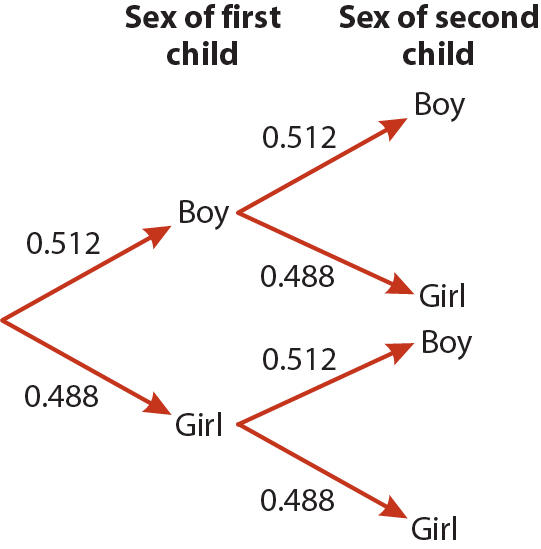

```{r setup, include=FALSE}
knitr::opts_chunk$set(echo = FALSE, warning=FALSE, message=FALSE, comment = "", collapse=TRUE)
options(width=60)
```

```{r}
library(tidyverse)
```


## Key terms


* *Outcome* -- the result of a process or experiment

* *Random Trial* -- a process or experiment that has two or more possible outcomes whose occurence can not be predicted with certainty

* *Event* -- a subset of the possible outcomes of a random trial

## Random Trials and Events -- Classical examples

* Random Trials
  - Flip a coin
  - Roll a six-sided die
  - Draw a card from a standard deck

* Events
  - Coins -- heads or tails
  - Dice -- roll a 1; roll 4 or greater
  - Cards -- draw a heart; draw an ace; draw an ace of hearts
  
## Random Trials and Events -- Biological examples

* Random Trials
  - Sex of the next offspring of a mating pair of birds in Duke forest
  - Change in resting heart rate in a group of healthy volunteers following treatment with a drug
  - Number of tree species at three field sites
  
* Events
  - Birds sex -- male or female
  - Drug trial -- Heart rate increased by more than 10 bpm; heart rate did not change or decreased; etc
  - Tree survey -- 5 species counted; 8 spcies; more than 10 species
  
## Probability: frequentist definition


### Probability of an event 

\medskip

The proportion of times the event would occur if we repeated a random trial an infinite (or very large) number of times under the same conditions.  

### Notation

\medskip
  
- To indicate the probability of an event $A$, we write $P(A)$


## Probability: Examples

\footnotesize

### Classical examples

When we understand the physical constraints and symmetries of a random trial, we can often assign theoretical probabilities: 

* Coins: With a fair coin, the probability of each face is 0.5

* Dice: Given a fair 20-side die, the probability of each outcome is 1/20 = 0.05; the probability of rolling a 15 or better is 6/20 = 0.3

* Cards: In randomly shuffled standard (French) 52-card deck, the probability of drawing a heart is 13/54 = 0.25; the probability of getting an ace is 4/52 = ~0.077

### Biology

For real-world problems, we can not usually invoke physical symmetries to assign theoretical probabilities *a prioiri* to events. We must estimate such probabilities from data!

- In human populations, the *sex ratio at birth* is *not* 1:1.  The probability of a child being male is ~0.512, and the probability of having a female child is ~0.488. 

\normalsize

## Probability distribution

*Probability distribution* -- A list, or equivalent representation, of the probabilities of all mutually exclusive outcomes of a random trial.

\medskip

A probability distribution is a relative frequency distribution as the number of observations approaches the size of the population (in the broad sense) under study.

## Examples of discrete probability distributions

```{r, echo=FALSE, warning=FALSE,message=FALSE}
library(tidyverse)
library(cowplot)
```


```{r discrete_prob_distn, echo=FALSE, fig.cap="Discrete probability distributions. A) Probability distribution for a single roll of a fair 6-sided die; B) Probability distribution for the number of white balls observed in three draws, without replacement, from an urn filled with 3 white balls and 2 black balls.", fig.width = 6, fig.height=3, fig.align='center', out.width="80%"}
dice.outcomes <- seq(1,6)
dice.probs <- rep(1/6, 6)
dice <- data.frame(outcomes = dice.outcomes, probability = dice.probs)
dice.plot <- 
  ggplot(dice, aes(x = outcomes, y = probability)) + 
  geom_col() + ylim(0,1) + 
  labs(x = "Die roll", y = "Probability")

urn.outcomes <- seq(1,3)
urn.probs <- c(0.3, 0.6, 0.1)
urns <- data.frame(outcomes = urn.outcomes, probability = urn.probs)
urn.plot <- 
  ggplot(urns, aes(x = outcomes, y = probability)) + 
  geom_col() + ylim(0,1) + 
  labs(x = "# of white balls in 3 draws", y = "Probability")

plot_grid(dice.plot, urn.plot, labels = c("A","B"))
```

## Example of a continuous probability distribution

```{r, fig.cap = "Distribution of total SAT scores for 2017 high school graduates. Assuming a normal distribution with mean = 1060, standard deviation = 195, based on data  reported in the 2017 SAT annual report. The probability that a randomly chosen student got a score better than 1255 is represented by the shaded area; P(Score > 1255) = 0.1587.", fig.align='center', echo = FALSE, out.width="60%", fig.height=4, fig.width=5}

SAT.mean = 1060
SAT.sd = 195
scores <- seq(400, 1700, 10)
SAT.density <- dnorm(scores, mean = SAT.mean, sd = SAT.sd)

ggplot(data.frame(scores = scores), aes(x = scores)) + 
  stat_function(fun = dnorm, args = list(mean = SAT.mean, sd = SAT.sd), xlim = c(400,1700), n = 200) +
    geom_area(aes(x = seq(1060+195, 1700, 10), y = dnorm(seq(1060+195, 1700, 10), mean = 1060, sd = 195)),fill = "gray", data = data.frame(x = seq(1060+195, 1700, 10))) +
  labs(x = "Score", y = "Density")
```

# Rules for working with probability

## Complement

The *complement*, $A^c$, of an event, $A$, is all the possible outcomes of a random trial that are *not* the event.  

\[
P(A^c) = 1 - P(A)
\]

- Sometimes it is easier to calculate the probability of an event's comoplement  rather than the probability of an event itself.


_Mutually exclusive events_ are events that can *not* both occur _simultaneously_ in the same random trial.

## Addition rule, mutually exclusive events

Two events are *mutually exclusive* if they can *not* both occur *simultaneously* in the same random trial.

If events A and B are mutually exclusive, then the probability of either event occuring is the sum of their individual probabilities:

\[
P(A\ \text{or}\ B) = P(A) + P(B)
\]

## Independence

* *Independence* -- two events are independent if the occurence of one does not inform us about the probability that the second.

* *Dependence* -- any events that are not independent are considered to be _dependent_.

### Multiplication rule, independent events

If events A and B are independent than:

\[
P(A\ \text{and}\ B) = P(A)P(B) 
\]


## General addition rule

The general form of the addition rule states:
\[
  P(A\ \text{or}\ B) = P(A) + P(B) - P(A\ \text{and}\ B)
\]


## Conditional probability

*Conditional probability* -- is the probability that an event occurs given that a condition is met. 

* Denoted: $P(A|B)$.  Read this as "the probability of A given B "or "the probability of A conditioned on B".

## Conditional probability example

Consider our urns and balls example, in which we make draws (without replacement) from an urn filled with three white balls and two black balls.

* The initial probability of drawing a black ball

\[
    P(B) = 2/5 = 0.4
\]

* If the first draw was a white ball, the probability of drawing a black ball is now
  
\[
    P(B|\text{1st ball W})) = 2/4 = 0.5
\]


## General multiplication rule

The general form of the multiplication rule is:
\[
P(A\ \text{and}\ B) = P(A)P(B|A)
\]


## Probability trees

Probability trees are diagrams that help calculate the probabilities of combinations of events. 

```{r, echo = FALSE, out.width = "40%", fig.align = "center", fig.cap = "Probability tree for two-child families, from Whitlock and Schluter, Ch. 5", eval = TRUE, results = "show"}

```


